# 🔄 Maç Canlıya Alma ve Sonuçlandırma Akış Şeması

**Tarih:** 2025-12-24  
**Sistem:** GoalGPT Backend - DigitalOcean + Supabase

---

## 📊 Tam Akış Şeması

```mermaid
graph TB
    Start([Sistem Başlatıldı]) --> Bootstrap[Bootstrap Service]
    
    %% Bootstrap Phase
    Bootstrap --> Diary1["/match/diary<br/>YYYYMMDD format<br/>Bugünkü maçları çek"]
    Diary1 --> DB1[(Database<br/>ts_matches<br/>status_id=1)]
    
    %% Daily Sync
    DB1 --> DailySync[DailyMatchSyncWorker<br/>Her 10 dakikada bir]
    DailySync --> Diary2["/match/diary<br/>Bugünkü maçları sync et"]
    Diary2 --> DB2[(Database<br/>Yeni maçlar eklendi)]
    
    %% Incremental Sync
    DB2 --> MatchSync[MatchSyncWorker<br/>Her 5 dakikada bir]
    MatchSync --> Recent1["/match/recent/list<br/>time parametresi ile<br/>Değişen maçları çek"]
    Recent1 --> DB3[(Database<br/>Maçlar güncellendi)]
    
    %% Should-Be-Live Detection
    DB3 --> Watchdog[MatchWatchdogWorker<br/>Her 30 saniyede bir]
    Watchdog --> Check1{Maç başlamalı mı?<br/>match_time geçti<br/>status_id=1}
    
    Check1 -->|Evet| Recent2["/match/recent/list<br/>Maç canlı mı kontrol et"]
    Recent2 --> Check2{Maç recent/list'te<br/>var mı?}
    
    Check2 -->|Evet, LIVE| UpdateStatus1[Status Güncelle<br/>status_id: 1 → 2,3,4,5,7]
    Check2 -->|Hayır| DetailLive1["/match/detail_live<br/>Fallback: detay çek"]
    Check2 -->|Hayır| Diary3["/match/diary<br/>Fallback: günlük programdan çek"]
    
    DetailLive1 --> UpdateStatus1
    Diary3 --> UpdateStatus1
    UpdateStatus1 --> DB4[(Database<br/>status_id güncellendi)]
    
    %% Proactive Check
    DB3 --> Proactive[ProactiveMatchStatusCheckWorker<br/>Her 2 dakikada bir]
    Proactive --> Check3{Bugünkü maçlar<br/>status_id=1<br/>match_time geçti}
    
    Check3 -->|Evet| DetailLive2["/match/detail_live<br/>Maç durumunu kontrol et"]
    DetailLive2 --> Check4{detail_live<br/>başarılı mı?}
    
    Check4 -->|Evet| UpdateStatus2[Status Güncelle]
    Check4 -->|Hayır| Diary4["/match/diary<br/>Fallback"]
    
    Diary4 --> UpdateStatus2
    UpdateStatus2 --> DB5[(Database<br/>status_id güncellendi)]
    
    %% Real-Time Updates
    DB4 --> DataUpdate[DataUpdateWorker<br/>Her 20 saniyede bir]
    DB5 --> DataUpdate
    
    DataUpdate --> DataUpdateAPI["/data/update<br/>Değişen maçları listele"]
    DataUpdateAPI --> Check5{Değişen maç<br/>var mı?}
    
    Check5 -->|Evet| DetailLive3["/match/detail_live<br/>Her değişen maç için"]
    DetailLive3 --> UpdateMatch[Maç Güncelle<br/>status, score, minute, events]
    UpdateMatch --> DB6[(Database<br/>Canlı veriler güncellendi)]
    
    %% WebSocket Updates
    DB4 --> WebSocket[WebSocketService<br/>MQTT Mesajları]
    DB5 --> WebSocket
    DB6 --> WebSocket
    
    WebSocket --> MQTT[MQTT Broker<br/>TheSports WebSocket]
    MQTT --> MessageTypes{Message Type?}
    
    MessageTypes -->|score| UpdateScore[Skor Güncelle]
    MessageTypes -->|tlive| UpdateStatus3[Status Güncelle<br/>HT, 2H, FT]
    MessageTypes -->|events| UpdateEvents[Eventler Güncelle]
    
    UpdateScore --> DB7[(Database<br/>score güncellendi)]
    UpdateStatus3 --> DB7
    UpdateEvents --> DB7
    
    %% Stale Match Recovery
    DB6 --> Watchdog2[MatchWatchdogWorker<br/>Stale Match Kontrolü]
    DB7 --> Watchdog2
    
    Watchdog2 --> Check6{Maç stale mı?<br/>last_event_ts > 120s<br/>veya<br/>provider_update_time > 120s}
    
    Check6 -->|Evet| Recent3["/match/recent/list<br/>Maç hala canlı mı?"]
    Recent3 --> Check7{Maç recent/list'te<br/>var mı?}
    
    Check7 -->|Evet, LIVE| DetailLive4["/match/detail_live<br/>Güncel veriyi çek"]
    Check7 -->|Evet, END| UpdateEnd1[Status: END<br/>status_id: 8]
    Check7 -->|Hayır| UpdateEnd2[Status: END<br/>Maç bitti]
    
    DetailLive4 --> UpdateMatch2[Maç Güncelle]
    UpdateEnd1 --> DB8[(Database<br/>status_id=8)]
    UpdateEnd2 --> DB8
    UpdateMatch2 --> DB8
    
    %% Minute Calculation
    DB6 --> MinuteWorker[MatchMinuteUpdateWorker<br/>Her 30 saniyede bir]
    DB7 --> MinuteWorker
    DB8 --> MinuteWorker
    
    MinuteWorker --> CalcMinute[Dakika Hesapla<br/>match_time vs now<br/>live_kickoff_time<br/>second_half_kickoff_time]
    CalcMinute --> UpdateMinute[Database'e minute yaz]
    UpdateMinute --> DB9[(Database<br/>minute güncellendi)]
    
    %% API Endpoint
    DB9 --> APILive["/api/matches/live<br/>Frontend için"]
    APILive --> Frontend[Frontend<br/>Tarayıcı]
    
    %% Match Finished
    DB8 --> Check8{Maç bitti mi?<br/>status_id=8}
    Check8 -->|Evet| Finished[Maç Sonuçlandı<br/>Final skor kaydedildi]
    
    style Start fill:#90EE90
    style Bootstrap fill:#87CEEB
    style DailySync fill:#87CEEB
    style MatchSync fill:#87CEEB
    style Watchdog fill:#FFD700
    style Proactive fill:#FFD700
    style DataUpdate fill:#FF6347
    style WebSocket fill:#FF6347
    style MinuteWorker fill:#9370DB
    style APILive fill:#32CD32
    style Frontend fill:#32CD32
    style Finished fill:#FF1493
```



---

## 🔗 TheSports API Endpoint'leri

### 1. **Bootstrap & Daily Sync**
```
GET https://api.thesports.com/v1/football/match/diary
Query Params:
  - date: YYYYMMDD (örn: 20251224)
```
**Kullanım:** İlk maçları database'e yüklemek, bugünkü programı çekmek

---

### 2. **Incremental Sync**
```
GET https://api.thesports.com/v1/football/match/recent/list
Query Params:
  - page: 1
  - limit: 500
  - time: Unix timestamp (sadece değişen maçları çekmek için)
```
**Kullanım:** Değişen maçları çekmek, should-be-live maçları kontrol etmek

---

### 3. **Live Match Details**
```
GET https://api.thesports.com/v1/football/match/detail_live
Query Params:
  - match_id: TheSports match ID
```
**Kullanım:** Canlı maç detaylarını çekmek (status, score, minute, events)

---

### 4. **Data Update Check**
```
GET https://api.thesports.com/v1/football/data/update
Query Params:
  - time: Unix timestamp (son kontrol zamanı)
```
**Kullanım:** Değişen maçları listele (changed_matches array)

---

### 5. **WebSocket (MQTT)**
```
wss://api.thesports.com/v1/football/ws
Message Types:
  - score: Skor güncellemeleri
  - tlive: Timeline/phase updates (HT, 2H, FT)
  - events: Maç eventleri
```
**Kullanım:** Real-time güncellemeler (en hızlı yöntem)

---

## 🔄 Worker'lar ve Çalışma Sıklığı

| Worker | Sıklık | Endpoint | Amaç |
|--------|--------|----------|------|
| **BootstrapService** | 1x (başlangıçta) | `/match/diary` | İlk maçları yükle |
| **DailyMatchSyncWorker** | Her 10 dakika | `/match/diary` | Bugünkü programı sync et |
| **MatchSyncWorker** | Her 5 dakika | `/match/recent/list` | Değişen maçları sync et |
| **MatchWatchdogWorker** | Her 30 saniye | `/match/recent/list` + `/match/detail_live` | Stale ve should-be-live maçları bul |
| **ProactiveMatchStatusCheckWorker** | Her 2 dakika | `/match/detail_live` + `/match/diary` | NOT_STARTED → LIVE geçişi |
| **DataUpdateWorker** | Her 20 saniye | `/data/update` + `/match/detail_live` | Real-time güncellemeler |
| **WebSocketService** | Sürekli (MQTT) | WebSocket | Real-time mesajlar |
| **MatchMinuteUpdateWorker** | Her 30 saniye | - | Dakika hesapla |

---

## 📝 Maç Durumu Geçişleri

### 1. **NOT_STARTED → LIVE**
```
status_id: 1 → 2,3,4,5,7

Tetikleyiciler:
- MatchWatchdogWorker: match_time geçti, recent/list'te LIVE
- ProactiveMatchStatusCheckWorker: match_time geçti, detail_live'da LIVE
- WebSocket: score mesajı geldi (status_id IN 2,3,4,5,7)
```

### 2. **LIVE → HALF_TIME**
```
status_id: 2,4,5,7 → 3

Tetikleyiciler:
- WebSocket: tlive mesajı "HT" veya "Half Time"
- MatchWatchdogWorker: detail_live'da status_id=3
- DataUpdateWorker: detail_live'da status_id=3
```

### 3. **HALF_TIME → SECOND_HALF**
```
status_id: 3 → 4

Tetikleyiciler:
- WebSocket: tlive mesajı "2H" veya "Second Half"
- MatchWatchdogWorker: detail_live'da status_id=4
- DataUpdateWorker: detail_live'da status_id=4
```

### 4. **LIVE → END**
```
status_id: 2,3,4,5,7 → 8

Tetikleyiciler:
- MatchWatchdogWorker: recent/list'te yok veya status_id=8
- WebSocket: tlive mesajı "FT" veya "Full Time"
- DataUpdateWorker: detail_live'da status_id=8
```

---

## 🎯 Örnek Senaryo: Bir Maçın Canlıya Alınması

### Adım 1: Maç Database'e Yüklenir
```
Bootstrap → /match/diary → Database
status_id: 1 (NOT_STARTED)
match_time: 1774544400 (2025-12-24 20:00:00 UTC)
```

### Adım 2: Maç Başlama Zamanı Geçer
```
match_time: 1774544400
now: 1774545000 (20:10:00)
status_id: hala 1 (NOT_STARTED)
```

### Adım 3: Watchdog Tespit Eder
```
MatchWatchdogWorker (30s) → findShouldBeLiveMatches()
Buldu: match_id, match_time geçti, status_id=1
```

### Adım 4: Recent/List Kontrolü
```
GET /match/recent/list
Response: match_id var, status_id=2 (FIRST_HALF)
```

### Adım 5: Status Güncelle
```
UPDATE ts_matches
SET status_id = 2
WHERE external_id = match_id
```

### Adım 6: Detail_Live Çek
```
GET /match/detail_live?match_id=xxx
Response: status_id=2, minute=10, score=[1,0]
```

### Adım 7: Database Güncelle
```
UPDATE ts_matches
SET status_id = 2,
    minute = 10,
    home_score_regular = 1,
    away_score_regular = 0,
    provider_update_time = 1774545000
WHERE external_id = match_id
```

### Adım 8: Frontend Görüntüler
```
GET /api/matches/live
Response: match görünür, CANLI badge, dakika "10"
```

---

## 🔍 Sorun Giderme

### Maç Canlıya Geçmiyor
1. **MatchWatchdogWorker çalışıyor mu?** → `pm2 logs goalgpt-backend | grep Watchdog`
2. **Recent/list'te maç var mı?** → `curl http://142.93.103.128:3000/api/provider/recent-list`
3. **Detail_live çalışıyor mu?** → `curl http://142.93.103.128:3000/api/matches/{match_id}/detail-live`

### Dakika Güncellenmiyor
1. **MatchMinuteUpdateWorker çalışıyor mu?** → `pm2 logs goalgpt-backend | grep Minute`
2. **live_kickoff_time set edilmiş mi?** → Database'de kontrol et
3. **minute field dolu mu?** → Database'de kontrol et

### Maç Bitmiyor
1. **Watchdog END'e geçiriyor mu?** → `pm2 logs goalgpt-backend | grep "transitioning to END"`
2. **Recent/list'te maç yok mu?** → Maç bitti, END'e geçirilmeli

---

## ✅ Test Endpoint'leri

### Backend Health
```
GET http://142.93.103.128:3000/health
```

### Live Matches
```
GET http://142.93.103.128:3000/api/matches/live
```

### Match Detail Live
```
GET http://142.93.103.128:3000/api/matches/{match_id}/detail-live
```

### Should-Be-Live Matches
```
GET http://142.93.103.128:3000/api/matches/should-be-live
```

---

## 📊 Database Tabloları

### ts_matches
- `external_id`: TheSports match ID
- `status_id`: 1=NOT_STARTED, 2=FIRST_HALF, 3=HALF_TIME, 4=SECOND_HALF, 5=OVERTIME, 7=PENALTIES, 8=END
- `match_time`: Maç başlama zamanı (Unix timestamp)
- `live_kickoff_time`: Gerçek başlama zamanı (WebSocket'ten)
- `minute`: Dakika (hesaplanmış)
- `home_score_regular`: Ev sahibi skoru
- `away_score_regular`: Deplasman skoru
- `provider_update_time`: Son güncelleme zamanı (TheSports'tan)
- `last_event_ts`: Son event zamanı

---

**Son Güncelleme:** 2025-12-24  
**Versiyon:** 1.0

