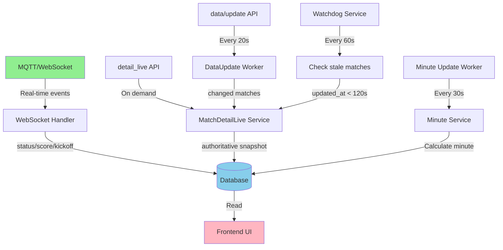

# Phase 3: Live Match Engine - Implementation Plan

## Overview

Phase 3 creates a robust live match synchronization system that maintains perfect sync between TheSports API and our database. The system uses MQTT as the authoritative source with detail_live as fallback, implements backend minute calculation, and adds watchdog mechanisms to catch stale matches.

---

## Architecture Decision Summary

Based on your decisions:

1. **DB Schema:** Add `first_half_kickoff_ts` + `second_half_kickoff_ts` columns
2. **Minute Source:** Backend calculation (kickoff_ts + now) → write to DB
3. **Source Priority:** MQTT authoritative, detail_live fallback
4. **Reconcile Policy:** data_update (20s) + watchdog (updated_at < 120s)
5. **UI:** DB-only mode (already implemented in Phase 2)

---

## Implementation Steps

### Step 1: Database Schema Migration

**File:** `src/database/migrations/add-phase3-live-columns.ts`

Add new columns to `ts_matches`:
- `first_half_kickoff_ts BIGINT` - First half kickoff timestamp (Unix seconds)
- `second_half_kickoff_ts BIGINT` - Second half kickoff timestamp (Unix seconds)
- `minute INTEGER` - Calculated minute (backend writes, UI reads)
- `provider_update_time BIGINT` - Last update time from provider (for optimistic locking)
- `last_minute_update_ts BIGINT` - Last time minute was recalculated

**Migration SQL:**
```sql
ALTER TABLE ts_matches
  ADD COLUMN IF NOT EXISTS first_half_kickoff_ts BIGINT,
  ADD COLUMN IF NOT EXISTS second_half_kickoff_ts BIGINT,
  ADD COLUMN IF NOT EXISTS minute INTEGER,
  ADD COLUMN IF NOT EXISTS provider_update_time BIGINT,
  ADD COLUMN IF NOT EXISTS last_minute_update_ts BIGINT;

CREATE INDEX IF NOT EXISTS idx_ts_matches_first_half_kickoff 
  ON ts_matches(first_half_kickoff_ts) WHERE first_half_kickoff_ts IS NOT NULL;
  
CREATE INDEX IF NOT EXISTS idx_ts_matches_second_half_kickoff 
  ON ts_matches(second_half_kickoff_ts) WHERE second_half_kickoff_ts IS NOT NULL;
  
CREATE INDEX IF NOT EXISTS idx_ts_matches_provider_update_time 
  ON ts_matches(provider_update_time) WHERE provider_update_time IS NOT NULL;
```

---

### Step 2: Backend Minute Calculation Service

**File:** `src/services/thesports/match/matchMinute.service.ts` (NEW)

Create a service to calculate and update match minutes:

```typescript
export class MatchMinuteService {
  /**
   * Calculate current minute based on status and kickoff times
   * Rules:
   * - First half: minute = now - first_half_kickoff_ts (max 45)
   * - HT: minute = 45 (frozen)
   * - Second half: minute = 45 + (now - second_half_kickoff_ts) (max 90)
   * - Overtime: minute = 90 + (now - overtime_kickoff_ts)
   */
  calculateMinute(
    statusId: number,
    firstHalfKickoff: number | null,
    secondHalfKickoff: number | null,
    now: number = Math.floor(Date.now() / 1000)
  ): number | null {
    // Implementation
  }

  /**
   * Update minute for a match in DB
   * Called periodically for live matches
   */
  async updateMatchMinute(matchId: string): Promise<void> {
    // Read match from DB
    // Calculate minute
    // Update DB if changed
  }

  /**
   * Batch update minutes for all live matches
   * Called every 30 seconds
   */
  async updateAllLiveMatchMinutes(): Promise<void> {
    // Query all live matches (status_id IN 2,3,4,5,7)
    // Calculate and update minutes
  }
}
```

---

### Step 3: MQTT Update Logic Enhancement

**File:** `src/services/thesports/websocket/websocket.service.ts`

**Changes:**

1. **Kickoff Time Extraction:**
   - Extract `first_half_kickoff_ts` from MQTT score message timestamp (when status transitions to FIRST_HALF)
   - Extract `second_half_kickoff_ts` from MQTT tlive message (when status transitions to SECOND_HALF)

2. **Optimistic Locking:**
   - Check `provider_update_time` before writing
   - Only update if MQTT `update_time > DB.provider_update_time`
   - Store MQTT message timestamp in `provider_update_time`

3. **Status Transition Detection:**
   - When status transitions from NOT_STARTED to FIRST_HALF: set `first_half_kickoff_ts = NOW()`
   - When status transitions from HALF_TIME to SECOND_HALF: set `second_half_kickoff_ts = NOW()`

**Code Changes:**
- Modify `updateMatchInDatabase()` to:
  - Accept and store `update_time` from MQTT
  - Set kickoff timestamps on status transitions
  - Add optimistic locking check
- Modify `handleMatchStateTransition()` to trigger kickoff timestamp storage

---

### Step 4: MatchDetailLiveService Enhancement

**File:** `src/services/thesports/match/matchDetailLive.service.ts`

**Changes:**

1. **Kickoff Time Extraction:**
   - Extract `first_half_kickoff_ts` from detail_live response
   - Extract `second_half_kickoff_ts` from detail_live response (if available)
   - Extract `update_time` from detail_live response

2. **Optimistic Locking:**
   - Only update if `detail_live.update_time > DB.provider_update_time`
   - Store `provider_update_time` when updating

3. **Minute Calculation:**
   - After updating status/kickoff, recalculate minute using `MatchMinuteService`
   - Write calculated minute to DB

**Key Logic:**
```typescript
// In reconcileMatchToDatabase()
if (live.updateTime && live.updateTime > existingProviderUpdateTime) {
  // Update all fields
  // Calculate and set minute
} else {
  logger.debug(`Skipping stale update for ${match_id}`);
}
```

---

### Step 5: DataUpdateWorker Enhancement

**File:** `src/jobs/dataUpdate.job.ts`

**Current:** Already calls `reconcileMatchToDatabase()` for changed matches.

**Enhancement:** Add `update_time` tracking to avoid unnecessary reconciles:
- Compare `data_update.update_time` with `DB.provider_update_time`
- Only reconcile if update_time is newer

---

### Step 6: Watchdog Service

**File:** `src/services/thesports/match/matchWatchdog.service.ts` (NEW)

**Purpose:** Automatically reconcile stale live matches.

**Implementation:**
```typescript
export class MatchWatchdogService {
  /**
   * Find and reconcile stale live matches
   * Stale = updated_at < now - 120 seconds AND status_id IN (2,3,4,5,7)
   */
  async reconcileStaleLiveMatches(): Promise<void> {
    const staleThreshold = Math.floor(Date.now() / 1000) - 120;
    
    // Query DB for stale matches
    const staleMatches = await pool.query(`
      SELECT external_id
      FROM ts_matches
      WHERE status_id IN (2,3,4,5,7)
        AND (provider_update_time < $1 OR provider_update_time IS NULL)
        AND updated_at < NOW() - INTERVAL '120 seconds'
      LIMIT 50
    `, [staleThreshold]);
    
    // Reconcile each match
    for (const match of staleMatches.rows) {
      await matchDetailLiveService.reconcileMatchToDatabase(match.external_id);
    }
  }
}
```

---

### Step 7: Watchdog Worker

**File:** `src/jobs/matchWatchdog.job.ts` (NEW)

**Purpose:** Run watchdog service every 60 seconds.

```typescript
export class MatchWatchdogWorker {
  private watchdogService: MatchWatchdogService;
  private intervalId: NodeJS.Timeout | null = null;
  
  start(): void {
    // Run every 60 seconds
    this.intervalId = setInterval(async () => {
      await this.watchdogService.reconcileStaleLiveMatches();
    }, 60000);
  }
  
  stop(): void {
    if (this.intervalId) {
      clearInterval(this.intervalId);
      this.intervalId = null;
    }
  }
}
```

Register in `src/server.ts` startup.

---

### Step 8: Minute Update Worker

**File:** `src/jobs/matchMinuteUpdate.job.ts` (NEW)

**Purpose:** Periodically recalculate minutes for all live matches.

```typescript
export class MatchMinuteUpdateWorker {
  private minuteService: MatchMinuteService;
  private intervalId: NodeJS.Timeout | null = null;
  
  start(): void {
    // Run every 30 seconds
    this.intervalId = setInterval(async () => {
      await this.minuteService.updateAllLiveMatchMinutes();
    }, 30000);
  }
  
  stop(): void {
    if (this.intervalId) {
      clearInterval(this.intervalId);
      this.intervalId = null;
    }
  }
}
```

Register in `src/server.ts` startup.

---

### Step 9: Match Transition to Live Logic

**Files:** 
- `src/services/thesports/websocket/websocket.service.ts`
- `src/services/thesports/match/matchDetailLive.service.ts`

**Rule:** Match transitions from NOT_STARTED to LIVE only when:
- MQTT score message has `status_id IN (2,3,4,5,7)` AND `minute >= 1` OR
- detail_live response has `status_id IN (2,3,4,5,7)` AND `minute >= 1`

**Implementation:**
- In MQTT handler: When status changes to FIRST_HALF, set `first_half_kickoff_ts = message_timestamp`
- In detail_live: Extract kickoff from response, set if not already set

---

### Step 10: Frontend Minute Display Update

**File:** `frontend/src/components/MatchCard.tsx`

**Current:** Frontend calculates minute using `calculateMatchMinute()` function.

**Change:** Read `minute` directly from DB response (no calculation).

```typescript
// OLD
const minute = calculateMatchMinute(kickoff, status, secondHalfKickoff);

// NEW
const minute = match.minute; // From DB
```

**Fallback:** If `minute` is null, fallback to calculation (for backward compatibility).

---

## Data Flow Diagram



---

## Critical Implementation Details

### 1. Optimistic Locking Pattern

All DB writes must check `provider_update_time`:

```typescript
// In updateMatchInDatabase()
const existing = await client.query(
  'SELECT provider_update_time FROM ts_matches WHERE external_id = $1',
  [matchId]
);

if (existing.rows[0] && newUpdateTime <= existing.rows[0].provider_update_time) {
  logger.debug(`Skipping stale update for ${matchId}`);
  return false;
}

// Proceed with update
await client.query(`
  UPDATE ts_matches
  SET 
    status_id = $1,
    provider_update_time = $2,
    ...
  WHERE external_id = $3
`, [statusId, newUpdateTime, matchId]);
```

### 2. Minute Calculation Rules

```typescript
if (statusId === MatchState.FIRST_HALF && firstHalfKickoff) {
  minute = Math.min(45, Math.floor((now - firstHalfKickoff) / 60) + 1);
} else if (statusId === MatchState.HALF_TIME) {
  minute = 45; // Frozen
} else if (statusId === MatchState.SECOND_HALF && secondHalfKickoff) {
  minute = Math.min(90, 45 + Math.floor((now - secondHalfKickoff) / 60) + 1);
} else if (statusId === MatchState.OVERTIME) {
  // Similar logic for overtime
}
```

### 3. Status Transition Detection

```typescript
// When status changes
if (oldStatus === MatchState.NOT_STARTED && newStatus === MatchState.FIRST_HALF) {
  // Set first_half_kickoff_ts
  await setFirstHalfKickoff(matchId, now);
}

if (oldStatus === MatchState.HALF_TIME && newStatus === MatchState.SECOND_HALF) {
  // Set second_half_kickoff_ts
  await setSecondHalfKickoff(matchId, now);
}
```

---

## Testing Strategy

### Unit Tests
- Minute calculation logic (various status/kickoff combinations)
- Optimistic locking (stale update rejection)
- Status transition detection

### Integration Tests
- MQTT → DB update flow
- detail_live → DB update flow
- Watchdog reconciliation
- Minute worker updates

### Manual Tests
1. Start a match → verify `first_half_kickoff_ts` set
2. Half time → verify minute frozen at 45
3. Second half → verify `second_half_kickoff_ts` set, minute continues from 46
4. Disconnect MQTT → verify watchdog reconciles after 120s
5. Verify UI shows correct minute from DB

---

## Migration Order

1. Run DB migration (add columns)
2. Deploy backend code (all services)
3. Restart server (workers start)
4. Verify MQTT updates working
5. Verify watchdog catching stale matches
6. Deploy frontend (read minute from DB)

---

## Rollback Plan

If issues occur:
1. Stop minute worker (frontend can calculate)
2. Remove optimistic locking (allow all updates)
3. Revert to single `live_kickoff_time` (ignore new columns)

---

## Success Criteria

- ✅ Live matches transition correctly (NOT_STARTED → LIVE)
- ✅ Minutes update correctly (backend calculates, DB stores)
- ✅ Stale matches auto-reconciled (watchdog working)
- ✅ No race conditions (optimistic locking prevents)
- ✅ UI shows correct minute from DB
- ✅ MQTT authoritative, detail_live fallback working

---

## Files to Create/Modify

### New Files
- `src/database/migrations/add-phase3-live-columns.ts`
- `src/services/thesports/match/matchMinute.service.ts`
- `src/services/thesports/match/matchWatchdog.service.ts`
- `src/jobs/matchWatchdog.job.ts`
- `src/jobs/matchMinuteUpdate.job.ts`

### Modified Files
- `src/services/thesports/websocket/websocket.service.ts`
- `src/services/thesports/match/matchDetailLive.service.ts`
- `src/jobs/dataUpdate.job.ts`
- `src/server.ts` (register new workers)
- `frontend/src/components/MatchCard.tsx`

---

## Phase 3 Decision Summary

| Decision | Choice | Rationale |
|----------|--------|-----------|
| DB Schema | Add `first_half_kickoff_ts` + `second_half_kickoff_ts` | Accurate second half minute calculation |
| Minute Source | Backend calculation → DB | Single source of truth, no frontend timezone issues |
| Source Priority | MQTT authoritative, detail_live fallback | Real-time updates from MQTT, detail_live for reconciliation |
| Reconcile Policy | data_update (20s) + watchdog (120s) | Catch all stale matches automatically |
| UI | DB-only mode | Already implemented in Phase 2 |


