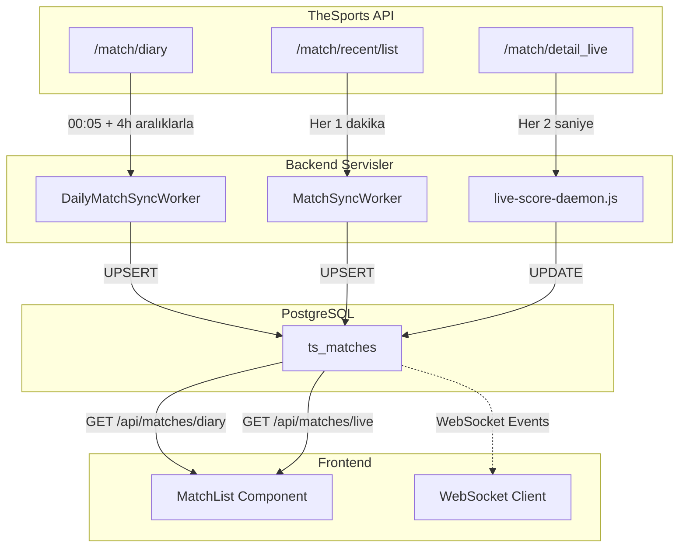
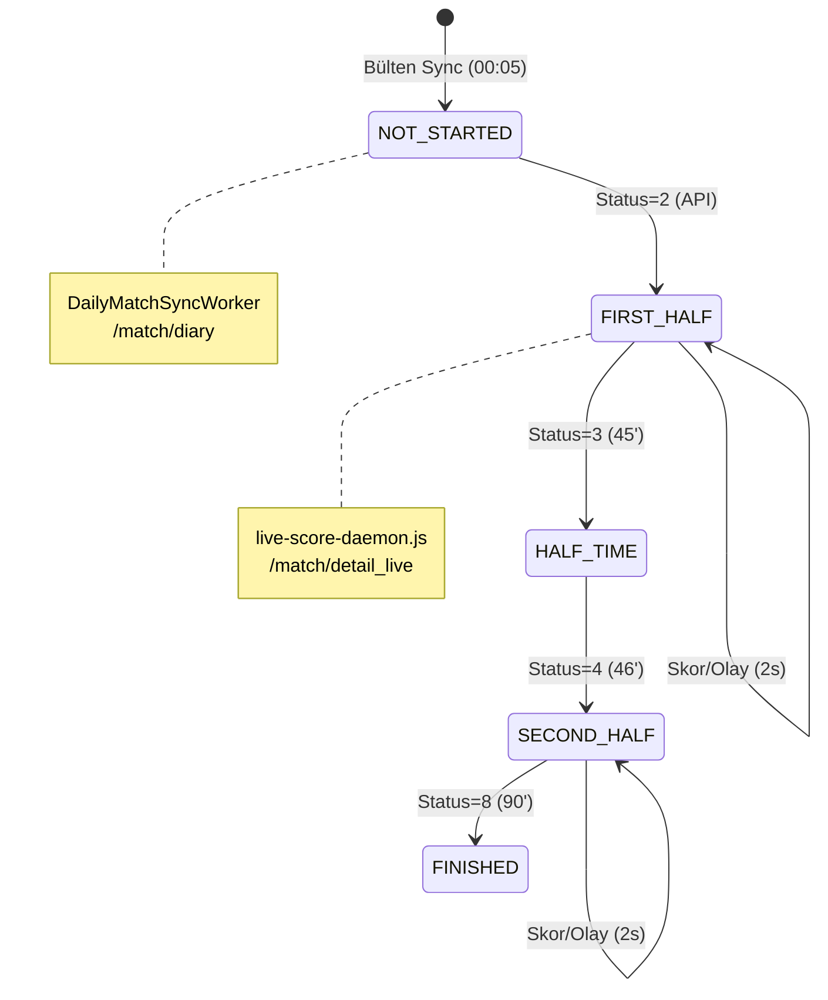

# Canlı Skor Sistemi Detaylı Denetim Raporu

## 📸 Kullanıcı Arayüzü Durumu

````carousel

<!-- slide -->

<!-- slide -->

<!-- slide -->

````

---

## 🏗️ Mevcut Sistem Mimarisi

### 1. Veri Senkronizasyonu Katmanları



### 2. Zamanlama Detayları

| Bileşen | Zamanlama | API Endpoint | Açıklama |
|---------|-----------|--------------|----------|
| **DailyMatchSyncWorker** | `00:05 TSİ` | `/match/diary` | 3 günlük pencere (dün, bugün, yarın) |
| **DailyMatchSyncWorker** | `Her 5 dakika` | `/match/diary` | Canlı yakalama (status güncellemeleri) |
| **DailyMatchSyncWorker** | `04:05, 08:05, 12:05, 16:05, 20:05` | `/match/diary` | Gün içi yeni maç kontrolü |
| **MatchSyncWorker** | `Her 1 dakika` | `/match/recent/list` | İnkremental senkronizasyon |
| **MatchSyncWorker** | `Her 3 saniye` | Reconcile Queue | Canlı maç durumu kontrolü |
| **MatchSyncWorker** | `Her 15 saniye` | Reconcile Queue | 2. yarı maçları (FT algılama) |
| **MatchSyncWorker** | `Her 20 saniye` | Reconcile Queue | 1. yarı maçları (HT algılama) |
| **MatchSyncWorker** | `Her 30 saniye` | Reconcile Queue | Devre arası maçları |
| **live-score-daemon.js** | `Her 2 saniye` | `/match/detail_live` | Skor ve olay güncellemeleri |
| **Frontend** | `Her 10 saniye` | `/api/matches/diary` veya `/live` | Polling |

---

## 🔄 Maç Yaşam Döngüsü Akışı



---

## ⚠️ Tespit Edilen Problemler

### Problem 1: "Günün Maçları" Sekmesi Boş

**Belirtiler:**
- Ekran görüntüsünde "Günün Maçları" sekmesi boş görünüyor
- Ama "Başlamayanlar" sekmesinde 121 maç var

**Olası Nedenler:**
1. **Tarih filtreleme hatası**: `getMatchesByDate()` TSİ tarih dönüşümünde sorun olabilir
2. **Veri yapısı uyumsuzluğu**: DB sorgusu doğru çalışıyor ama frontend'e gönderilmiyor

**Kod İncelemesi:**
- [match.controller.ts L213-220](file:///Users/utkubozbay/Desktop/project/src/controllers/match.controller.ts#L213-L220): `matchDatabaseService.getMatchesByDate(dbDate)` çağrılıyor
- Sorun muhtemelen tarih formatında veya sorgu koşullarında

---

### Problem 2: Canlı Maç Statüsü Gecikmesi

**Belirtiler:**
- Maçlar başladığında hemen "Canlı" olarak görünmüyor
- Status güncellemesi dakikalar sürebiliyor

**Sebep:**
- `live-score-daemon.js` sadece skor günceller, **status güncellemesi yapmıyor** (aslında yapıyor ama...)
- Satır 143-166: Status güncelleniyor AMA sadece `/match/detail_live` tarafından dönen maçlar için

**Kritik Sorun:**
```javascript
// live-score-daemon.js L59
const response = await fetchFromApi('/match/detail_live', {});
```
- `/match/detail_live` endpoint'i sadece **son 120 dakikadaki maçları** döndürür
- Yani maç henüz başlamamışsa ve status=1 ise, bu endpoint onu döndürmez
- **Dolayısıyla "Başlamadı" durumundan "1. Yarı" durumuna GEÇEMEZ**

---

### Problem 3: Status Geçişi Yetersiz

**Mevcut Durum:**
- `MatchSyncWorker.reconcileLiveMatches()` sadece `status_id IN (2, 3, 4, 5, 7)` maçları işler
- Satır 43: `LIVE_STATUS_IDS = [2, 3, 4, 5, 7]`
- **Status=1 (NOT_STARTED) maçlar reconcile edilmiyor!**

**Sonuç:**
- Maç başladığında (API'de status=2 olduğunda) bu bilgi DB'ye aktarılmıyor
- Çünkü status=1 olan maçlar reconcile kuyruğuna eklenmıyor

---

### Problem 4: "Günün Maçları" ve "Bitenler/Başlamayanlar" Tutarsızlığı

**Gözlem:**
- Bitenler: 7 maç
- Başlamayanlar: 121 maç
- **Toplam: 128 maç**
- Günün Maçları: 0 (boş)

**Beklenen:**
- Günün Maçları = Bitenler + Canlı + Başlamayanlar olmalı

**Olası Sorun:**
- Frontend `view === 'diary'` için filter kullanmıyor (L88: "diary view shows all matches")
- Ama data gelmiyor çünkü `getMatchesByDate()` boş dönüyor

---

## 🛠️ Önerilen Çözümler

### Çözüm 1: Status Reconcile Kapsamını Genişlet

**Dosya:** `matchSync.job.ts`

```typescript
// YENİ: "Should Start" maçları için ek interval
private readonly SHOULD_START_STATUS_IDS = [1]; // NOT_STARTED

// start() içine ekle:
this.shouldStartInterval = setInterval(() => {
  this.enqueueMatchesForReconcile(
    this.SHOULD_START_STATUS_IDS, 
    'ShouldStartReconcile', 
    500, 
    { matchTimeFilter: 'past' } // Sadece başlama saati geçmiş olanlar
  );
}, 60000); // Her 1 dakika
```

---

### Çözüm 2: Live Score Daemon'a Proaktif Kontrol Ekle

**Dosya:** `live-score-daemon.js`

```javascript
async function checkShouldStartMatches() {
    const client = await pool.connect();
    try {
        const now = Math.floor(Date.now() / 1000);
        
        // Son 30 dakikada başlaması gereken ama henüz başlamamış maçları bul
        const result = await client.query(`
            SELECT external_id FROM ts_matches 
            WHERE status_id = 1 
            AND match_time < $1 
            AND match_time > $1 - 1800
        `, [now]);
        
        for (const row of result.rows) {
            // Her maç için detail_live API'den kontrol et
            const detail = await fetchFromApi('/match/detail_live', { id: row.external_id });
            // Status değişmişse güncelle
        }
    } finally {
        client.release();
    }
}

// Her 30 saniyede bir çalıştır
setInterval(checkShouldStartMatches, 30000);
```

---

### Çözüm 3: Günün Maçları Sorgu Düzeltmesi

**Dosya:** `matchDatabase.service.ts` - `getMatchesByDate()`

**Kontrol edilmesi gerekenler:**
1. Tarih dönüşümü doğru mu? (TSİ vs UTC)
2. `DATE(to_timestamp(m.match_time))` hesaplaması doğru mu?
3. Timezone farkı var mı?

---

## 📋 Aksiyon Planı

| Öncelik | Aksiyon | Dosya | Tahmini Süre |
|---------|---------|-------|--------------|
| 🔴 P0 | "Günün Maçları" boş dönme sorununu düzelt | matchDatabase.service.ts | 2 saat |
| 🔴 P0 | Status=1 → Status=2 geçişini düzelt | matchSync.job.ts | 3 saat |
| 🟠 P1 | Live daemon'a proaktif check ekle | live-score-daemon.js | 2 saat |
| 🟠 P1 | Reconcile kapsamını genişlet | matchSync.job.ts | 1 saat |
| 🟢 P2 | WebSocket event'leri düzelt | Frontend | 2 saat |

---

## 📊 Özet

**Kritik Bulgular:**
1. ❌ "Günün Maçları" sekmesi çalışmıyor (veri gelmiyor)
2. ❌ Status=1 → Status=2 geçişi güvenilir değil
3. ⚠️ Live daemon sadece zaten canlı olan maçları güncelliyor
4. ⚠️ Reconcile mekanizması NOT_STARTED maçları kapsamıyor

**Sonraki Adım:**
Bu raporu onaylarsanız, yukarıdaki aksiyon planına göre düzeltmeleri uygulamaya başlayabilirim.
