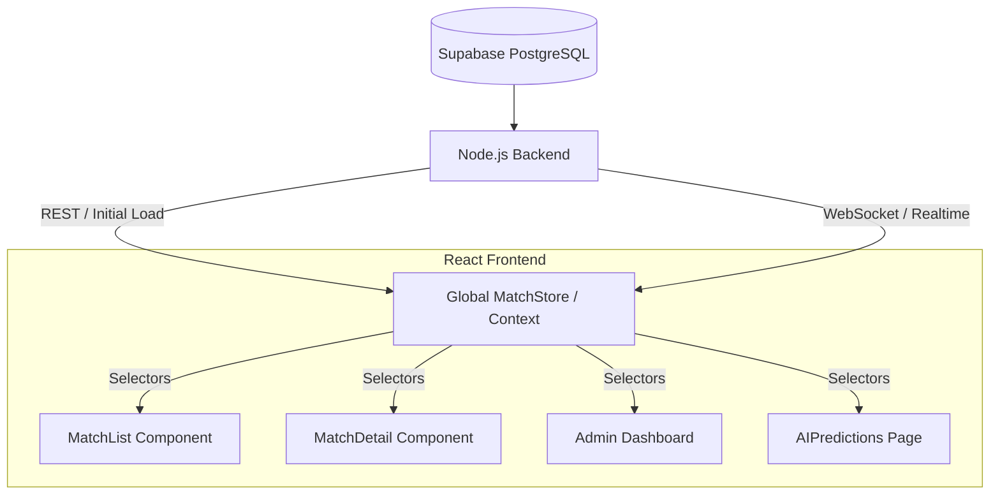

# Frontend Architecture Analysis & Refactoring Plan

**Date:** 2026-01-06
**Author:** Jules (Senior Backend Architect)
**Status:** DRAFT

## 1. Problem Definition: Data Desync & Spaghetti Code

The current GoalGPT frontend suffers from inconsistent data states across different components. This is primarily caused by:
- **Duplicate Data Fetching:** Multiple components (`MatchList`, `MatchDetail`, `Admin` panels) fetch the same data independently.
- **Fragmented State Management:** `AIPredictionsContext` handles predictions, but match scores are often handled locally or via separate hooks.
- **Multiple WebSocket Connections:** Several components attempt to establish or manage their own real-time connections, leading to race conditions and potential stale data.
- **"Any" Type Usage:** Widespread use of `any` bypasses TypeScript's safety, making refactoring risky.

## 2. Identified Redundancies (The "Anti-Spaghetti" Audit)

### A. Context Overlap
- **Deleted:** `UnifiedPredictionContext.tsx` was identified as dead code and removed.
- **Active:** `AIPredictionsContext.tsx` is the current active provider but needs to be strictly typed and better integrated with match data.

### B. Component-Level Fetching
- **`MatchList.tsx`**: Currently fetches `getLiveMatches` / `getMatchDiary` internally.
  - *Issue:* Re-fetches data on every mount/tab switch. Does not share state with `MatchDetail`.
- **`MatchDetailContext.tsx`**: Fetches specific match details.
  - *Issue:* If a goal happens while user is on the list view, and then clicks detail, they might see a flash of old data if the fetch isn't perfectly synced or cached.

## 3. Proposed Architecture: Single Source of Truth

We will transition to a **Centralized Data Flow** pattern.

### Key Principles

1.  **Global Match Store:**
    - A single `MatchContext` (or Redux/Zustand store) that holds a dictionary of matches: `Record<MatchId, Match>`.
    - All components read from this store.
    - `MatchList` only triggers a "refresh" action on the store, it doesn't store data itself.

2.  **Unified WebSocket Manager:**
    - A single `SocketManager` initialized at the App root.
    - Listens for:
        - `SCORE_CHANGE`
        - `MATCH_STATE_CHANGE`
        - `PREDICTION_SETTLED`
    - On event: Updates the **Global Match Store** directly.
    - Result: Instant, synchronized updates across the entire UI.

3.  **Strict Typing (No "Any"):**
    - Enforce strict interfaces for `Match`, `Prediction`, and `Event` objects.
    - Shared types between API clients and Components.

## 4. Implementation Steps (Roadmap)

### Phase 1: Cleanup (Done)
- [x] Identify and remove unused Contexts (`UnifiedPredictionContext`).
- [x] Document the current state.

### Phase 2: Type Hardening
- [ ] Create a `types/` directory.
- [ ] Define comprehensive `Match` and `Prediction` interfaces.
- [ ] Replace `any` in `api/matches.ts` and `AIPredictionsContext.tsx`.

### Phase 3: Centralization
- [ ] Create `LivescoreContext` (or `GlobalMatchContext`) that wraps the application.
- [ ] Move fetching logic from `MatchList` to this context.
- [ ] Implement the Single WebSocket Listener in this context.

### Phase 4: Component Refactor
- [ ] Update `MatchList` to consume `LivescoreContext`.
- [ ] Update `MatchDetail` to read initial state from `LivescoreContext` (fallback to fetch if not found).

## 5. Technical Constraints
- **Framework:** React 18 + TypeScript
- **State:** React Context (avoid Redux unless necessary for performance).
- **Styling:** Tailwind CSS (maintain existing look).
- **Directory:** Keep strict folder structure defined in `CLAUDE.md`.
