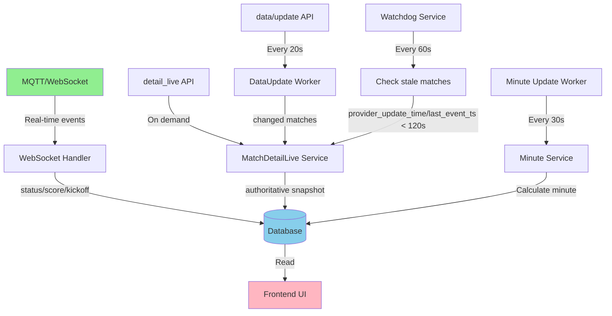

# Phase 3: Live Match Engine - Implementation Plan

## Overview

Phase 3 creates a robust live match synchronization system that maintains perfect sync between TheSports API and our database. The system uses MQTT as the authoritative source with detail_live as fallback, implements backend minute calculation, and adds watchdog mechanisms to catch stale matches.

---

## Architecture Corrections

**Critical fixes based on production debugging:**

1. **Status Mapping:** Fixed to match TheSports provider mapping (8=END/FT, 9=Delay, 10=Interrupt, 11=Cut in half, 12=Cancel, 13=TBD)
2. **Optimistic Locking:** Uses `provider_update_time` (provider's timestamp) + `last_event_ts` (our ingestion time) - NEVER `updated_at`
3. **Watchdog Stale Criteria:** Uses `provider_update_time`/`last_event_ts` (NOT `updated_at`) to detect stale matches
4. **Kickoff Source Tracking:** Documented fallback hierarchy (provider kickoff → ingestion time)
5. **Overtime Support:** Added `overtime_kickoff_ts` for overtime minute calculation
6. **Minute Write Minimization:** Only update DB when minute value changes or threshold elapsed (reduce DB spam)
7. **detail_live Parsing:** No fallback to first array element if match_id not found (prevents wrong data)
8. **Penalty/Overtime Minute Handling:** Status 7 (PEN) and Status 5 (OT) keep last computed minute in DB (UI shows label override)
9. **Kickoff Overwrite Rule:** Allow overwrite if current kickoff is fallback and provider kickoff available
10. **provider_update_time Rule:** Use `max(existing, incoming)` to always advance timestamp
11. **Live List Filter:** Status-based only (status_id IN 2,3,4,5,7), time filter optional for cleanup only
12. **HALF_TIME Watchdog Exempt:** Status 3 (HT) is NOT reconciled by watchdog (frozen state, no reconcile spam)
13. **Delay/Interrupt DB & UI:** Status 9/10 preserve minute for sorting, UI shows "ERT"/"INT", kickoff_ts never overwritten
14. **Watchdog-DataUpdate Conflict Prevention:** Idempotent check in reconcileMatchToDatabase() prevents duplicate reconciles

---

## Architecture Decision Summary

Based on your decisions and production corrections:

1. **DB Schema:** Add `first_half_kickoff_ts` + `second_half_kickoff_ts` + `overtime_kickoff_ts` columns
2. **Minute Source:** Backend calculation (kickoff_ts + now) → write to DB (minimize writes)
3. **Source Priority:** MQTT authoritative, detail_live fallback
4. **Reconcile Policy:** data_update (20s) + watchdog (provider_update_time/last_event_ts < 120s, NOT updated_at)
5. **UI:** DB-only mode (controllers read DB, workers write DB, UI reads minute from DB)
6. **Optimistic Locking:** Dual timestamp system (provider_update_time + last_event_ts)
7. **Status Mapping:** Correct TheSports provider codes (8=FT, 9=Delay, 10=Interrupt, etc.)

---

## Implementation Steps

### Step 1: Database Schema Migration

**File:** `src/database/migrations/add-phase3-live-columns.ts`

Add new columns to `ts_matches`:

- `first_half_kickoff_ts BIGINT` - First half kickoff timestamp (Unix seconds)
- `second_half_kickoff_ts BIGINT` - Second half kickoff timestamp (Unix seconds)
- `overtime_kickoff_ts BIGINT` - Overtime kickoff timestamp (Unix seconds)
- `minute INTEGER` - Calculated minute (backend writes, UI reads)
- `provider_update_time BIGINT` - Provider's update_time from API (for optimistic locking)
- `last_event_ts BIGINT` - Our ingestion timestamp (when we processed the event)
- `last_minute_update_ts BIGINT` - Last time minute was recalculated

**Migration SQL:**

```sql
ALTER TABLE ts_matches
  ADD COLUMN IF NOT EXISTS first_half_kickoff_ts BIGINT,
  ADD COLUMN IF NOT EXISTS second_half_kickoff_ts BIGINT,
  ADD COLUMN IF NOT EXISTS overtime_kickoff_ts BIGINT,
  ADD COLUMN IF NOT EXISTS minute INTEGER,
  ADD COLUMN IF NOT EXISTS provider_update_time BIGINT,
  ADD COLUMN IF NOT EXISTS last_event_ts BIGINT,
  ADD COLUMN IF NOT EXISTS last_minute_update_ts BIGINT;

CREATE INDEX IF NOT EXISTS idx_ts_matches_first_half_kickoff 
  ON ts_matches(first_half_kickoff_ts) WHERE first_half_kickoff_ts IS NOT NULL;
  
CREATE INDEX IF NOT EXISTS idx_ts_matches_second_half_kickoff 
  ON ts_matches(second_half_kickoff_ts) WHERE second_half_kickoff_ts IS NOT NULL;
  
CREATE INDEX IF NOT EXISTS idx_ts_matches_overtime_kickoff 
  ON ts_matches(overtime_kickoff_ts) WHERE overtime_kickoff_ts IS NOT NULL;
  
CREATE INDEX IF NOT EXISTS idx_ts_matches_provider_update_time 
  ON ts_matches(provider_update_time) WHERE provider_update_time IS NOT NULL;
  
CREATE INDEX IF NOT EXISTS idx_ts_matches_last_event_ts 
  ON ts_matches(last_event_ts) WHERE last_event_ts IS NOT NULL;
```

---

### Step 2: Backend Minute Calculation Service

**File:** `src/services/thesports/match/matchMinute.service.ts` (NEW)

Create a service to calculate and update match minutes:

```typescript
export class MatchMinuteService {
  /**
   * Calculate current minute based on status and kickoff times
   * Rules:
   * - FIRST_HALF (2): minute = floor((now - first_half_kickoff_ts)/60)+1 (cap at 45)
   * - HALF_TIME (3): minute = 45 (frozen, never advance)
   * - SECOND_HALF (4): minute = 45 + floor((now - second_half_kickoff_ts)/60)+1 (cap at 90)
   * - OVERTIME (5): minute = 90 + floor((now - overtime_kickoff_ts)/60)+1 (continue calculating)
   * - PENALTY_SHOOTOUT (7): keep last computed minute value in DB (UI shows "PEN" label override)
   * - Exceptional states (9=Delay, 10=Interrupt, 11=Cut in half, 12=Cancel): keep last computed minute (frozen)
   * - END (8): keep last computed minute (UI shows "FT" label override)
   */
  calculateMinute(
    statusId: number,
    firstHalfKickoff: number | null,
    secondHalfKickoff: number | null,
    overtimeKickoff: number | null,
    now: number = Math.floor(Date.now() / 1000)
  ): number | null {
    // Implementation with correct status mapping
  }

  /**
   * Update minute for a match in DB
   * ONLY updates if minute value changed OR last_minute_update_ts older than threshold
   * Called periodically for live matches
   */
  async updateMatchMinute(matchId: string): Promise<void> {
    // Read match from DB
    // Calculate new minute
    // Update DB ONLY if changed or threshold elapsed (minimize writes)
  }

  /**
   * Batch update minutes for all live matches
   * ONLY computes for statuses 2,4,5 (not 3,7,9,10,11,12)
   * Status 7 (PENALTY): keeps last computed minute in DB (UI shows "PEN" label)
   * Status 5 (OVERTIME): continues calculating minute
   * Called every 30 seconds
   * Limits to 100 matches per batch (covers peak load: Turkey night + South America matches)
   */
  async updateAllLiveMatchMinutes(): Promise<void> {
    // Query live matches (status_id IN 2,4,5 only)
    // Calculate and update minutes (only if changed or threshold elapsed)
    // Batch limit: 100 per tick (covers peak load scenarios)
  }
}
```

---

### Step 3: MQTT Update Logic Enhancement

**File:** `src/services/thesports/websocket/websocket.service.ts`

**Changes:**

1. **Kickoff Time Extraction:**

                                                                                                                                                                                                - Extract `first_half_kickoff_ts` from MQTT score message timestamp (when status transitions to FIRST_HALF)
                                                                                                                                                                                                - Extract `second_half_kickoff_ts` from MQTT tlive message (when status transitions to SECOND_HALF)

2. **Optimistic Locking:**

   - Check freshness using dual timestamp system:
     - If MQTT payload has `update_time`: compare to `DB.provider_update_time` → skip if stale
     - If no `update_time`: compare to `DB.last_event_ts` → skip if stale
   - NEVER use `updated_at` for provider freshness (minute worker can update it)
   - Store MQTT `update_time` in `provider_update_time` (if provided)
   - Store ingestion time in `last_event_ts` (always)

3. **Status Transition Detection & Kickoff Capture:**

   - When status transitions from NOT_STARTED (1) to FIRST_HALF (2):
     - Prefer provider kickoff timestamp from MQTT/detail_live if available
     - Else use ingestion time (now) as fallback
     - Set `first_half_kickoff_ts`
     - **Kickoff overwrite rule:** If current kickoff was set via fallback and provider kickoff now available → overwrite allowed
   - When status transitions from HALF_TIME (3) to SECOND_HALF (4):
     - Prefer provider second half kickoff if available
     - Else use ingestion time as fallback
     - Set `second_half_kickoff_ts`
     - **Kickoff overwrite rule:** Same - if fallback exists and provider kickoff available → overwrite
   - When status transitions from SECOND_HALF (4) to OVERTIME (5):
     - Set `overtime_kickoff_ts` (similar fallback logic)
     - **Kickoff overwrite rule:** Same - if fallback exists and provider kickoff available → overwrite

**Code Changes:**

- Modify `updateMatchInDatabase()` to:
                                                                                                                                - Accept and store `update_time` from MQTT
                                                                                                                                - Set kickoff timestamps on status transitions
                                                                                                                                - Add optimistic locking check
- Modify `handleMatchStateTransition()` to trigger kickoff timestamp storage

---

### Step 4: MatchDetailLiveService Enhancement

**File:** `src/services/thesports/match/matchDetailLive.service.ts`

**Changes:**

1. **Kickoff Time Extraction:**

   - Extract `first_half_kickoff_ts` from detail_live response
   - Extract `second_half_kickoff_ts` from detail_live response (if available)
   - Extract `overtime_kickoff_ts` from detail_live response (if available)
   - Extract `update_time` from detail_live response

2. **Optimistic Locking:**

   - Check freshness using dual timestamp system:
     - If detail_live has `update_time`: compare to `DB.provider_update_time` → skip if stale
     - If no `update_time`: compare to `DB.last_event_ts` → skip if stale
   - NEVER use `updated_at` for provider freshness
   - **provider_update_time rule:** Store `max(DB.provider_update_time, incoming_update_time)` if provider update_time exists
   - If incoming payload has no provider update_time, use `last_event_ts` comparison
   - Store ingestion time in `last_event_ts` (always)

3. **Minute Calculation:**

   - After updating status/kickoff, recalculate minute using `MatchMinuteService`
   - Write calculated minute to DB (only if changed or threshold elapsed)

4. **detail_live Parsing Safety:**

   - If detail_live returns array format: find match by `match_id`
   - If match_id not found in array → return null ("No usable data")
   - DO NOT fallback to first array element (prevents writing wrong match data)

**Key Logic:**

```typescript
// In reconcileMatchToDatabase()
// CRITICAL: This function is called by both DataUpdateWorker and WatchdogService
// Idempotent check prevents conflicts if both reconcile the same match simultaneously
const existing = await getExistingMatch(match_id);
const existingProviderTime = existing.provider_update_time;
const existingEventTime = existing.last_event_ts;

// Check freshness (idempotent guard)
if (live.updateTime) {
  // Provider supplied update_time
  if (existingProviderTime && live.updateTime <= existingProviderTime) {
    logger.debug(`Skipping stale update for ${match_id} (provider time)`);
    return; // Safe to skip - already processed or newer update exists
  }
} else {
  // No provider update_time, use event time
  const ingestionTime = Math.floor(Date.now() / 1000);
  if (existingEventTime && ingestionTime <= existingEventTime + 5) {
    logger.debug(`Skipping stale update for ${match_id} (event time)`);
    return; // Safe to skip - recent update already processed
  }
}

// Update all fields
// Calculate and set minute
// Store provider_update_time (if provided) + last_event_ts (always)
```

**Watchdog-DataUpdate Conflict Prevention:**
- Both services call `reconcileMatchToDatabase()` which has idempotent check
- If incoming `provider_update_time <= existing.provider_update_time` → RETURN (safe skip)
- This prevents duplicate reconciles and race conditions when both services target the same match

---

### Step 5: DataUpdateWorker Enhancement

**File:** `src/jobs/dataUpdate.job.ts`

**Current:** Already calls `reconcileMatchToDatabase()` for changed matches.

**Enhancement:** Add `update_time` tracking to avoid unnecessary reconciles:

- Compare `data_update.update_time` with `DB.provider_update_time`
- Only reconcile if update_time is newer

---

### Step 6: Watchdog Service

**File:** `src/services/thesports/match/matchWatchdog.service.ts` (NEW)

**Purpose:** Automatically reconcile stale live matches.

**Implementation:**

```typescript
export class MatchWatchdogService {
  /**
   * Find and reconcile stale live matches
   * CRITICAL: Stale = live status AND (provider_update_time OR last_event_ts) older than 120s
   * DO NOT use updated_at (minute worker can update it and mask staleness)
   * 
   * WATCHDOG EXEMPT: Status 3 (HALF_TIME) is NOT reconciled by watchdog
   * - HT is a frozen state, reconcile only happens when status changes
   * - Prevents unnecessary reconcile spam for matches stuck in HT
   */
  async reconcileStaleLiveMatches(): Promise<void> {
    const staleThreshold = Math.floor(Date.now() / 1000) - 120;
    
    // Query DB for stale matches using provider/event timestamps
    // CRITICAL: Status 3 (HALF_TIME) is EXEMPT from watchdog reconciliation
    // HT is a frozen state - no need to reconcile unless status changes
    const staleMatches = await pool.query(`
      SELECT external_id
      FROM ts_matches
      WHERE status_id IN (2,4,5,7)  -- EXCLUDING 3 (HALF_TIME)
        AND (
          (provider_update_time IS NOT NULL AND provider_update_time < $1)
          OR (provider_update_time IS NULL AND last_event_ts < $1)
          OR (last_event_ts IS NULL)
        )
      LIMIT 100
    `, [staleThreshold]);
    
    // Reconcile each match
    // NOTE: reconcileMatchToDatabase() has idempotent check (provider_update_time comparison)
    // This prevents conflicts if DataUpdateWorker and Watchdog reconcile the same match simultaneously
    for (const match of staleMatches.rows) {
      await matchDetailLiveService.reconcileMatchToDatabase(match.external_id);
    }
  }
}
```

---

### Step 7: Watchdog Worker

**File:** `src/jobs/matchWatchdog.job.ts` (NEW)

**Purpose:** Run watchdog service every 60 seconds.

```typescript
export class MatchWatchdogWorker {
  private watchdogService: MatchWatchdogService;
  private intervalId: NodeJS.Timeout | null = null;
  
  start(): void {
    // Run every 60 seconds
    this.intervalId = setInterval(async () => {
      await this.watchdogService.reconcileStaleLiveMatches();
    }, 60000);
  }
  
  stop(): void {
    if (this.intervalId) {
      clearInterval(this.intervalId);
      this.intervalId = null;
    }
  }
}
```

Register in `src/server.ts` startup.

---

### Step 8: Minute Update Worker

**File:** `src/jobs/matchMinuteUpdate.job.ts` (NEW)

**Purpose:** Periodically recalculate minutes for all live matches.

**CRITICAL:** Only updates minutes for statuses that advance (2,4,5). Status 3 (HT) is frozen at 45, status 7 (PEN) shows "PEN".

```typescript
export class MatchMinuteUpdateWorker {
  private minuteService: MatchMinuteService;
  private intervalId: NodeJS.Timeout | null = null;
  
  start(): void {
    // Run every 30 seconds
    this.intervalId = setInterval(async () => {
      await this.minuteService.updateAllLiveMatchMinutes();
    }, 30000);
  }
  
  stop(): void {
    if (this.intervalId) {
      clearInterval(this.intervalId);
      this.intervalId = null;
    }
  }
}
```

**Minute Update Logic:**
- Only compute for status_id IN (2,4,5) - advancing states
- Status 3 (HT): minute = 45 (frozen, never update)
- Status 5 (OT): Continue calculating minute (90 + overtime elapsed)
- Status 7 (PEN): Keep last computed minute in DB (UI shows "PEN" label override for display, minute preserved for sorting/filtering)
- Status 8 (END): Keep last computed minute in DB (UI shows "FT" label override)
- Status 9,10,11,12: Keep last computed minute (exceptional states, frozen)
- Update DB only if minute value changed OR `last_minute_update_ts` older than 30s
- Batch limit: 100 matches per tick (covers peak load scenarios)

**Key principle:** DB minute field preserves last computed value even for frozen/label states (7,8,9,10,11,12) to enable proper sorting/filtering. UI displays label override for these states.

Register in `src/server.ts` startup.

---

### Step 9: Match Transition to Live Logic

**Files:**

- `src/services/thesports/websocket/websocket.service.ts`
- `src/services/thesports/match/matchDetailLive.service.ts`

**Rule:** Match transitions from NOT_STARTED to LIVE only when:

- MQTT score message has `status_id IN (2,3,4,5,7)` AND (minute >= 1 OR status_id = 2) OR
- detail_live response has `status_id IN (2,3,4,5,7)` AND (minute >= 1 OR status_id = 2)

**Implementation:**

- In MQTT handler: 
  - When status changes 1→2 (NOT_STARTED→FIRST_HALF): 
    - Prefer provider kickoff timestamp if available
    - Else use message timestamp (ingestion time)
    - Set `first_half_kickoff_ts`
  - When status changes 3→4 (HALF_TIME→SECOND_HALF):
    - Set `second_half_kickoff_ts` (similar fallback logic)
  - When status changes 4→5 (SECOND_HALF→OVERTIME):
    - Set `overtime_kickoff_ts` (similar fallback logic)
- In detail_live: Extract kickoff from response
  - If kickoff not set → set it (provider or fallback)
  - If kickoff was set via fallback and provider kickoff now available → overwrite allowed
  - If kickoff was set via provider → never overwrite (preserve original)

---

### Step 10: Frontend Minute Display Update

**File:** `frontend/src/components/MatchCard.tsx`

**Current:** Frontend calculates minute using `calculateMatchMinute()` function.

**Change:** Read `minute` directly from DB response (no calculation).

```typescript
// OLD
const minute = calculateMatchMinute(kickoff, status, secondHalfKickoff);

// NEW
const minute = match.minute; // From DB (backend calculated)
```

**Fallback:** If `minute` is null, fallback to calculation (for backward compatibility during migration).

**UI Display Rules:**
- Status 3 (HALF_TIME): Show "HT" or "İY" (minute = 45, frozen in DB)
- Status 5 (OVERTIME): Show calculated minute from DB (e.g., "90+3" or "ET 3")
- Status 7 (PENALTY_SHOOTOUT): Show "PEN" label (minute field in DB keeps last computed value for sorting/filtering)
- Status 8 (END): Show "FT" or "MS" label (minute field in DB keeps last computed value for sorting/filtering)
- Status 9 (DELAY): Show "ERT" label (minute field in DB keeps last computed value for sorting/filtering)
- Status 10 (INTERRUPT): Show "INT" label (minute field in DB keeps last computed value for sorting/filtering)
- Status 11 (CUT_IN_HALF), 12 (CANCEL): Show appropriate label, minute frozen (keeps last value)
- Status 2,4: Show calculated minute from DB

**Key principle:** DB minute field preserves last computed value even for frozen states (7,8,9,10,11,12) to enable proper sorting/filtering. UI displays label override for these states.

**Status 9/10 (Delay/Interrupt) Specific Rules:**
- **DB:** minute → preserves last computed value, kickoff_ts → NEVER overwrite
- **UI:** Status 9 → "ERT", Status 10 → "INT"
- **List sorting:** Continues based on minute field (maintains order)

---

## Data Flow Diagram



---

## Critical Implementation Details

### 1. Optimistic Locking Pattern (Dual Timestamp System)

All DB writes must check freshness using dual timestamp system:

```typescript
// In updateMatchInDatabase()
const existing = await client.query(
  'SELECT provider_update_time, last_event_ts FROM ts_matches WHERE external_id = $1',
  [matchId]
);

const existingProviderTime = existing.rows[0]?.provider_update_time;
const existingEventTime = existing.rows[0]?.last_event_ts;
const ingestionTime = Math.floor(Date.now() / 1000);

// Check freshness
if (incomingProviderUpdateTime) {
  // Provider supplied update_time
  if (existingProviderTime && incomingProviderUpdateTime <= existingProviderTime) {
    logger.debug(`Skipping stale update for ${matchId} (provider time)`);
    return false;
  }
  // provider_update_time rule: use max(existing, incoming) to always advance
  const newProviderUpdateTime = Math.max(existingProviderTime || 0, incomingProviderUpdateTime);
} else {
  // No provider update_time, use event time comparison
  if (existingEventTime && ingestionTime <= existingEventTime + 5) {
    logger.debug(`Skipping stale update for ${matchId} (event time)`);
    return false;
  }
}

// Proceed with update
await client.query(`
  UPDATE ts_matches
  SET 
    status_id = $1,
    provider_update_time = CASE 
      WHEN $2 IS NOT NULL THEN GREATEST(COALESCE(provider_update_time, 0), $2)
      ELSE provider_update_time
    END,
    last_event_ts = $3,
    ...
  WHERE external_id = $4
`, [statusId, incomingProviderUpdateTime, ingestionTime, matchId]);
```

**CRITICAL:** NEVER use `updated_at` for provider freshness (minute worker can update it).

### 2. Minute Calculation Rules (Correct Status Mapping)

```typescript
// Status mapping: 2=FIRST_HALF, 3=HALF_TIME, 4=SECOND_HALF, 5=OVERTIME, 7=PENALTY_SHOOTOUT
// 8=END, 9=DELAY, 10=INTERRUPT, 11=CUT_IN_HALF, 12=CANCEL, 13=TO_BE_DETERMINED

if (statusId === MatchState.FIRST_HALF && firstHalfKickoff) {
  // First half: floor((now - first_half_kickoff_ts)/60)+1, cap at 45
  minute = Math.min(45, Math.floor((now - firstHalfKickoff) / 60) + 1);
} else if (statusId === MatchState.HALF_TIME) {
  minute = 45; // Frozen, never advance
} else if (statusId === MatchState.SECOND_HALF && secondHalfKickoff) {
  // Second half: 45 + floor((now - second_half_kickoff_ts)/60)+1, cap at 90
  minute = Math.min(90, 45 + Math.floor((now - secondHalfKickoff) / 60) + 1);
} else if (statusId === MatchState.OVERTIME && overtimeKickoff) {
  // Overtime: 90 + floor((now - overtime_kickoff_ts)/60)+1
  minute = 90 + Math.floor((now - overtimeKickoff) / 60) + 1;
} else if (statusId === MatchState.PENALTY_SHOOTOUT) {
  // Penalty: keep last computed minute in DB (UI shows "PEN" label override)
  // Don't recalculate, preserve existing minute value for sorting/filtering
  minute = existingMinute; // Return existing minute from DB, don't update
} else if (statusId === MatchState.DELAY) {
  // Delay (9): keep last computed minute, NEVER overwrite kickoff_ts
  // UI shows "ERT" label, minute preserved for sorting/filtering
  minute = existingMinute; // Return existing minute from DB, don't update
} else if (statusId === MatchState.INTERRUPT) {
  // Interrupt (10): keep last computed minute, NEVER overwrite kickoff_ts
  // UI shows "INT" label, minute preserved for sorting/filtering
  minute = existingMinute; // Return existing minute from DB, don't update
} else if (statusId === MatchState.CUT_IN_HALF || 
           statusId === MatchState.CANCEL) {
  // Exceptional states: keep last computed minute (frozen)
  minute = existingMinute; // Return existing minute from DB, don't update
} else if (statusId === MatchState.END) {
  // END (8): keep last computed minute (UI shows "FT" label override)
  minute = existingMinute; // Return existing minute from DB, don't update
}
```

### 3. Status Transition Detection & Kickoff Source Tracking

```typescript
// When status changes - capture kickoff timestamps with source tracking

if (oldStatus === MatchState.NOT_STARTED && newStatus === MatchState.FIRST_HALF) {
  // Prefer provider kickoff timestamp if available
  const providerKickoff = extractProviderKickoffTime(mqttMessage);
  const existingKickoff = await getExistingKickoff(matchId, 'first_half');
  const existingSource = getKickoffSource(matchId, 'first_half');
  
  // Kickoff overwrite rule: if current is fallback and provider kickoff exists → overwrite allowed
  if (existingKickoff && existingSource === 'ingestion_fallback' && providerKickoff) {
    await setFirstHalfKickoff(matchId, providerKickoff, 'provider');
  } else if (!existingKickoff) {
    // First time setting
    const kickoffTime = providerKickoff ?? Math.floor(Date.now() / 1000);
    const kickoffSource = providerKickoff ? 'provider' : 'ingestion_fallback';
    await setFirstHalfKickoff(matchId, kickoffTime, kickoffSource);
  }
  // If existing is already from provider, don't overwrite
}

if (oldStatus === MatchState.HALF_TIME && newStatus === MatchState.SECOND_HALF) {
  // Similar logic for second half with overwrite rule
  const providerKickoff = extractProviderSecondHalfKickoff(mqttMessage);
  const existingKickoff = await getExistingKickoff(matchId, 'second_half');
  const existingSource = getKickoffSource(matchId, 'second_half');
  
  if (existingKickoff && existingSource === 'ingestion_fallback' && providerKickoff) {
    await setSecondHalfKickoff(matchId, providerKickoff, 'provider');
  } else if (!existingKickoff) {
    const kickoffTime = providerKickoff ?? Math.floor(Date.now() / 1000);
    const kickoffSource = providerKickoff ? 'provider' : 'ingestion_fallback';
    await setSecondHalfKickoff(matchId, kickoffTime, kickoffSource);
  }
}

if (oldStatus === MatchState.SECOND_HALF && newStatus === MatchState.OVERTIME) {
  // Overtime kickoff with overwrite rule
  const providerKickoff = extractProviderOvertimeKickoff(mqttMessage);
  const existingKickoff = await getExistingKickoff(matchId, 'overtime');
  const existingSource = getKickoffSource(matchId, 'overtime');
  
  if (existingKickoff && existingSource === 'ingestion_fallback' && providerKickoff) {
    await setOvertimeKickoff(matchId, providerKickoff, 'provider');
  } else if (!existingKickoff) {
    const kickoffTime = providerKickoff ?? Math.floor(Date.now() / 1000);
    const kickoffSource = providerKickoff ? 'provider' : 'ingestion_fallback';
    await setOvertimeKickoff(matchId, kickoffTime, kickoffSource);
  }
}
```

**Kickoff Source Tracking (Optional - Log Level Only):**
- Document in code/logs whether kickoff came from provider or ingestion fallback
- **First deploy:** Do NOT add `kickoff_source_first`, `kickoff_source_second` columns to DB
- Track source in application logs only
- If debugging becomes critical, can add columns in Phase 3.1

---

## Data Flow Clarification

### Controller Endpoints (DB-Only)

- `GET /api/matches/diary` → Reads ONLY from DB (no API fallback)
- `GET /api/matches/live` → Reads ONLY from DB (no API fallback)
- Controllers never call provider APIs directly

### Workers/Services (Write to DB)

- **MQTT/WebSocket Handler:** Receives real-time events → writes to DB
- **DataUpdateWorker:** Calls `/data/update` → reconciles changed matches → writes to DB
- **MatchDetailLiveService:** Called by workers → writes to DB
- **MatchMinuteService:** Calculates minutes → writes to DB

### UI (Read from DB)

- Frontend calls controller endpoints → gets data from DB
- Minute field read from DB (no client-side calculation)
- Fallback to client calculation only if `minute` is null (backward compatibility during migration)

---

## Testing Strategy

### Unit Tests

- Minute calculation logic (various status/kickoff combinations)
- Optimistic locking (stale update rejection using dual timestamp system)
- Status transition detection
- Exceptional state handling (9,10,11,12)
- Overtime minute calculation

### Integration Tests

- MQTT → DB update flow (with optimistic locking)
- detail_live → DB update flow (with optimistic locking)
- Watchdog reconciliation (using provider_update_time/last_event_ts)
- Minute worker updates (only for statuses 2,4,5)
- Kickoff timestamp capture on transitions

### Manual Tests

1. Start a match → verify `first_half_kickoff_ts` set (provider or fallback)
2. Half time → verify minute frozen at 45 (no DB updates)
3. Second half → verify `second_half_kickoff_ts` set, minute continues from 46
4. Overtime → verify `overtime_kickoff_ts` set, minute continues from 91
5. Disconnect MQTT → verify watchdog reconciles after 120s (using provider_update_time/last_event_ts)
6. Verify UI shows correct minute from DB (no client calculation)
7. Verify stale update rejection (optimistic locking working)
8. Test exceptional states (9,10,11,12) → minute frozen

---

## Migration Order

1. Run DB migration (add columns)
2. Deploy backend code (all services)
3. Restart server (workers start)
4. Verify MQTT updates working
5. Verify watchdog catching stale matches
6. Deploy frontend (read minute from DB)

---

## Rollback Plan

If issues occur:
1. Stop minute worker (frontend can calculate)
2. Remove optimistic locking (allow all updates)
3. Revert to single `live_kickoff_time` (ignore new columns)

---

## Success Criteria

- ✅ Live matches transition correctly (NOT_STARTED → LIVE)
- ✅ Minutes update correctly (backend calculates, DB stores, UI reads)
- ✅ Stale matches auto-reconciled (watchdog working using provider_update_time/last_event_ts)
- ✅ No race conditions (optimistic locking prevents using dual timestamp system)
- ✅ UI shows correct minute from DB (no client calculation)
- ✅ MQTT authoritative, detail_live fallback working
- ✅ Exceptional states (9,10,11,12) handled correctly (minute frozen)
- ✅ Overtime minute calculation working

---

## Implementation Phases (Minimum Viable Live Engine)

Phase 3 can be split into 3 incremental phases for safer deployment:

### Phase 3A: DB Migration + Optimistic Locking
**Goal:** Foundation layer - schema and write protection

**Deliverables:**
- Run DB migration (add columns: kickoff timestamps, minute, provider_update_time, last_event_ts, last_minute_update_ts)
- Implement optimistic locking pattern in existing write paths (MQTT, detail_live)
- Add dual timestamp system (provider_update_time + last_event_ts)
- Test: Verify stale updates are rejected correctly

**Files:**
- `src/database/migrations/add-phase3-live-columns.ts`
- `src/services/thesports/websocket/websocket.service.ts` (optimistic locking)
- `src/services/thesports/match/matchDetailLive.service.ts` (optimistic locking)

---

### Phase 3B: DataUpdate + detail_live Reconcile + Watchdog
**Goal:** Reconciliation layer - catch stale matches automatically

**Deliverables:**
- Enhance DataUpdateWorker with update_time tracking
- Enhance MatchDetailLiveService with kickoff extraction and minute calculation
- Implement MatchWatchdogService (reconcile stale matches)
- Implement MatchWatchdogWorker (runs every 60s)
- Test: Verify watchdog catches stale matches, detail_live reconciles correctly

**Files:**
- `src/services/thesports/match/matchWatchdog.service.ts` (NEW)
- `src/jobs/matchWatchdog.job.ts` (NEW)
- `src/jobs/dataUpdate.job.ts` (update_time tracking)
- `src/services/thesports/match/matchDetailLive.service.ts` (enhancements)

---

### Phase 3C: MQTT Event Ingest + Minute Worker + Frontend Minute Reading
**Goal:** Real-time layer - live updates and minute calculation

**Deliverables:**
- Enhance MQTT handler with kickoff timestamp capture on status transitions
- Implement MatchMinuteService (calculate and update minutes)
- Implement MatchMinuteUpdateWorker (runs every 30s)
- Update frontend to read minute from DB (remove client calculation)
- Test: Verify minutes update correctly, UI shows correct minute

**Files:**
- `src/services/thesports/match/matchMinute.service.ts` (NEW)
- `src/jobs/matchMinuteUpdate.job.ts` (NEW)
- `src/services/thesports/websocket/websocket.service.ts` (kickoff capture)
- `frontend/src/components/MatchCard.tsx` (read minute from DB)

---

## Files to Create/Modify

### New Files
- `src/database/migrations/add-phase3-live-columns.ts`
- `src/services/thesports/match/matchMinute.service.ts`
- `src/services/thesports/match/matchWatchdog.service.ts`
- `src/jobs/matchWatchdog.job.ts`
- `src/jobs/matchMinuteUpdate.job.ts`

### Modified Files
- `src/services/thesports/websocket/websocket.service.ts`
- `src/services/thesports/match/matchDetailLive.service.ts`
- `src/jobs/dataUpdate.job.ts`
- `src/server.ts` (register new workers)
- `frontend/src/components/MatchCard.tsx`

---

## Phase 3 Decision Summary

| Decision | Choice | Rationale |
|----------|--------|-----------|
| DB Schema | Add `first_half_kickoff_ts` + `second_half_kickoff_ts` + `overtime_kickoff_ts` | Accurate minute calculation for all phases |
| Minute Source | Backend calculation → DB | Single source of truth, no frontend timezone issues |
| Source Priority | MQTT authoritative, detail_live fallback | Real-time updates from MQTT, detail_live for reconciliation |
| Reconcile Policy | data_update (20s) + watchdog (provider_update_time/last_event_ts < 120s) | Catch all stale matches automatically, NOT using updated_at |
| UI | DB-only mode | Controllers read DB, workers write DB, UI reads minute from DB |
| Optimistic Locking | Dual timestamp (provider_update_time + last_event_ts) | Never use updated_at for provider freshness |
| Status Mapping | Correct TheSports codes (8=FT, 9=Delay, 10=Interrupt, etc.) | Match provider's actual status codes |